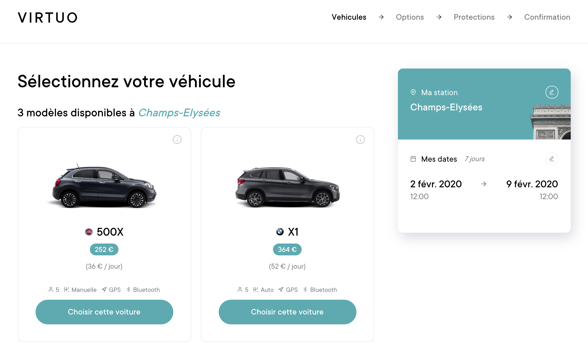
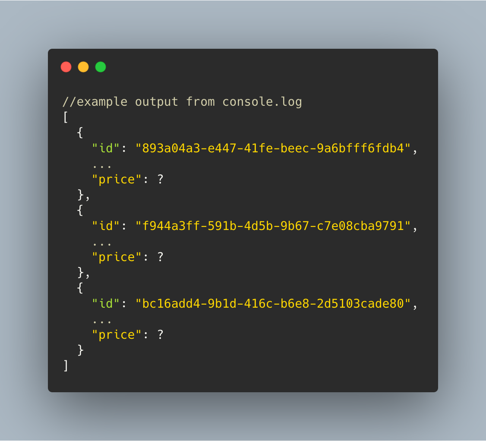
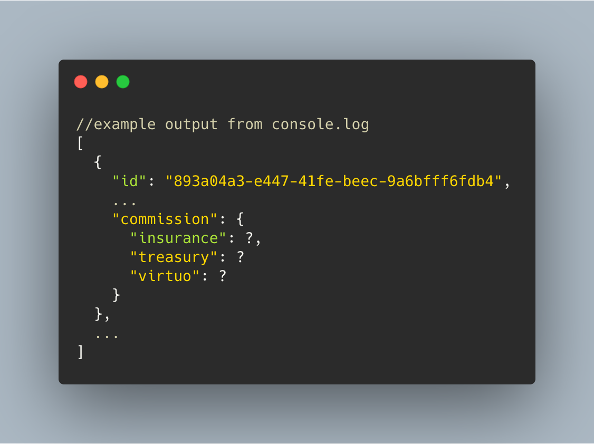
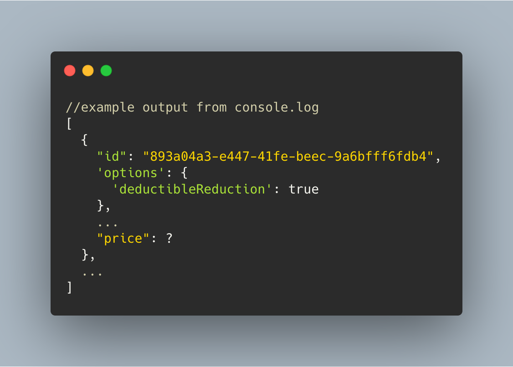
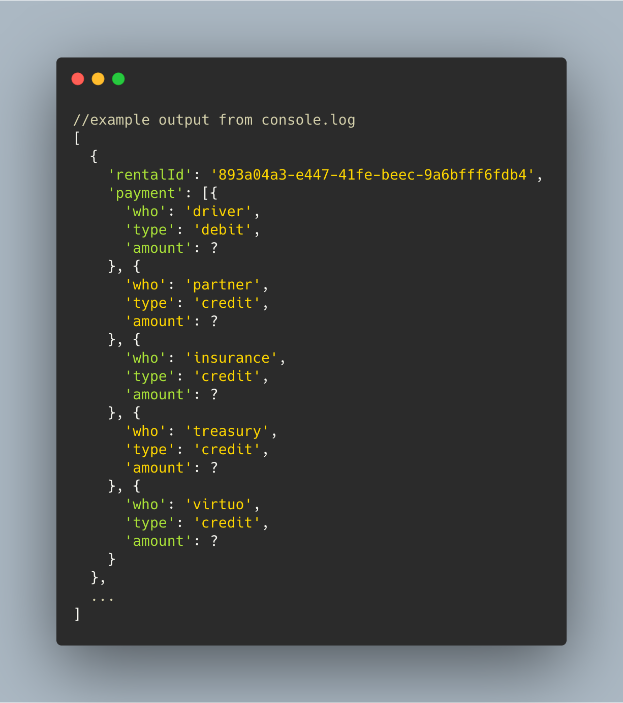

[](https://gitpod.io/#https://github.com/92bondstreet/virtuo) 

# VIRTUO

> JavaScript workshop based on the french startup https://www.govirtuo.com



<!-- START doctoc generated TOC please keep comment here to allow auto update -->
<!-- DON'T EDIT THIS SECTION, INSTEAD RE-RUN doctoc TO UPDATE -->
**Table of Contents**

- [🐣 Introduction](#-introduction)
- [🎯 Objectives](#-objectives)
- [👩‍💻 Just tell me what to do](#%E2%80%8D-just-tell-me-what-to-do)
  - [Don't forget:](#dont-forget)
- [🏃‍♀️ Steps to do](#%E2%80%8D-steps-to-do)
  - [⌚ Step 1 - Euro-Kilometers](#-step-1---euro-kilometers)
    - [Rental price](#rental-price)
    - [Just tell me what to do](#just-tell-me-what-to-do)
  - [🍺 Step 2 - Drive more, pay less](#-step-2---drive-more-pay-less)
    - [Decreasing pricing for longer rentals](#decreasing-pricing-for-longer-rentals)
    - [New price rules](#new-price-rules)
    - [Just tell me what to do](#just-tell-me-what-to-do-1)
  - [💰 Step 3 - Give me all your money](#-step-3---give-me-all-your-money)
    - [Commission](#commission)
    - [Just tell me what to do](#just-tell-me-what-to-do-2)
  - [💸 Step 4 - The famous deductible](#-step-4---the-famous-deductible)
    - [The deductible](#the-deductible)
    - [Just tell me what to do](#just-tell-me-what-to-do-3)
  - [💳 Step 5 - Pay the actors](#-step-5---pay-the-actors)
    - [The actors](#the-actors)
    - [Just tell me what to do](#just-tell-me-what-to-do-4)
- [Source and inspiration](#source-and-inspiration)
- [Licence](#licence)

<!-- END doctoc generated TOC please keep comment here to allow auto update -->

## 🐣 Introduction

[Virtuo](https://www.govirtuo.com) is a French start-up that digitizes the car rental industry across Europe via a Web Application.

The Rental car market is a key sector of the Europe economy:

* 54 billion euros Worldwide in revenue (prediction for 2020)
* 1 billion euros in France in revenue (prediction for 2020)
* Historically time consuming: wasted queuing for the rental desk, paperwork nor pre-rental inspection...

[Virtuo](https://www.youtube.com/watch?v=vpQYucMDZ9M) is a trusted third party between the [premium partners like BMW or Mercedes](https://discover.govirtuo.com/experts) and the drivers. The application allows:

* the drivers to find a car 24/7
* the drivers to book with an one-click a car for a given period
* the drivers to unlock cars with a seamless mobile-only experience
* the premium partners to maximize their rental rate and therefore the revenue of their business

## 🎯 Objectives

We focus on this application feature: `to book with an one-click a car for a given period`.

The workshop goals are to

1. compute the rental price of the `driver`
2. compute the profit of the `partner`
3. compute the profit of `virtuo`

## 👩‍💻 Just tell me what to do

1. Be sure to have a GitHub account.

If not, you should create a [GitHub account](https://github.com/join) then [add your ssh to your github profile](https://help.github.com/articles/connecting-to-github-with-ssh) for a better authentication.

2. Fork the project via `github`


3. Clone your forked repository project `https://github.com/YOUR_USERNAME/virtuo`

```sh
❯ cd /path/to/workspace
❯ git clone git@github.com:YOUR_USERNAME/virtuo.git
```

4. Open the entry point [/public/index.html](./public/index.html) in your browser (that loads the `index.js` file)

```sh
# macos cli
❯ open public/index.html
# linux cli
❯ xdg-open public/index.html

# or by double-clicking in your browser files
```

5. Check the ouput in your browser console (Use `Ctrl + Shift + J` or `Cmd + Opt + J` to focus to your console devtools)
6. Solve each steps inside [./public/index.js](./public/index.js) file with JavaScript
7. Once a step is solved, commit your modification:

```sh
❯ cd /path/to/workspace/virtuo
❯ git add -A && git commit -m "feat(price): decrease pricing according days"
```

([why following a commit message convention?](https://www.conventionalcommits.org)

8. 5 steps, so ideally 5 commits
9. Don't forget to push before the end of the workshop

```sh
❯ git push origin master
```

**Note**: if you catch an error about authentication, [add your ssh to your github profile](https://help.github.com/articles/connecting-to-github-with-ssh/).

10. Check that your codebase works by checking the console output
11. If you need some helps on git commands, read [git - the simple guide](http://rogerdudler.github.io/git-guide/)

### Don't forget:

* DRY - Don't repeat yourself
* DOT - Do One Thing
* KISS - Keep It Simple Stupid
* LIM - Less Is More
* English only: codebase, variables, comments...

**Focus only on coding, forgot the browser display (next workshop!).**

**Use `console.log` to display results (for the moment)**

## 🏃‍♀️ Steps to do

### 🚙 Step 1 - Euro-Kilometers

#### Rental price

The `driver` books a car for a specific time range and an approximate distance.

The rental price is the sum of the time component and the distance component with

* **time component**: the number of rental days multiplied by the `car` price per day
* **distance component**: the number of kilometers multiplied by the `car`s price per km

```
rental price = time + distance
```

#### Just tell me what to do

Write JS code that generates the rental price for each `driver` from `index.js` file:



### 🛣 Step 2 - Drive more, pay less

#### Decreasing pricing for longer rentals

To be as competitive as possible, `Virtuo` decide to have a decreasing pricing for longer rentals.

#### New price rules

**price per people**

* decreases by **10% after 1 day**
* decreases by **30% after 4 days**
* decreases by **50% after 10 days**

#### Just tell me what to do

Adapt the rental price computation to take these new rules into account.


### 💰 Step 3 - Give me all your money

Now, it's time to pay `Virtuo`

There is a 30% commission on the rental price to cover the costs.

#### Commission

The commission is split like this:

* **insurance**: half of commission
* **the Treasury**: 1€ by day
* **Virtuo**: the rest

#### Just tell me what to do

Compute the amount that belongs to the `insurance`, to the `Treasury` and to `Virtuo`.



### 💸 Step 4 - The famous deductible

In case of an accident/theft, `Virtuo` applies a 5000€ deductible.

The driver can reduce the deductible amount from 5000€ to 500€ with a `deductible option` for a few more euros per day.

#### The deductible

The driver is charged an additional 4€/day when he chooses the `deductible reduction` option.

**The additional charge goes to `Virtuo`, not to the partner.**

#### Just tell me what to do

Compute the new rental price if the driver subscribed to `deductible option`.



### 💳 Step 5 - Pay the actors

#### The actors

It's time to debit/credit each actor!

- **the driver** must pay the **rental price** and the **(optional) deductible reduction**
- **the partner** receives the **rental price** minus the **commission**
- **the insurance** receives its part of the **commission**
- **the Treasury** receives its part of the tax **commission**
- **Virtuo receives** its part of the **commission**, plus the **deductible reduction**

#### Just tell me what to do

* Compute the debit for the `driver`
* Compute the credit of the `partner`, `insurance`, `Treasury` and `Virtuo`.



## Source and inspiration

* [Virtuo](https://www.virtuo.com)
* [Getaround EU Challenges (previously Drivy)](https://github.com/drivy/jobs)

## Licence

[Uncopyrighted](http://zenhabits.net/uncopyright/)
