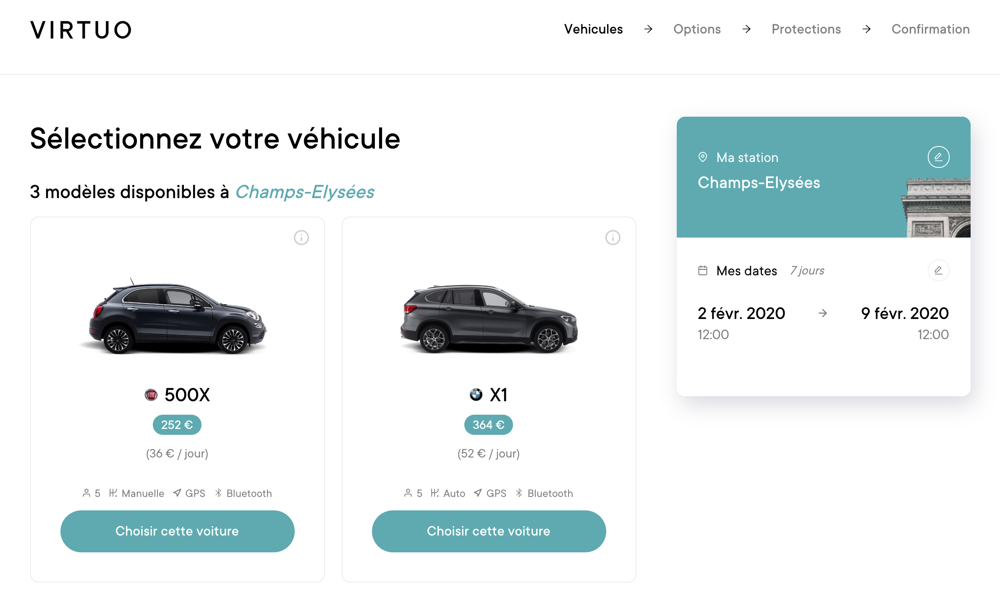
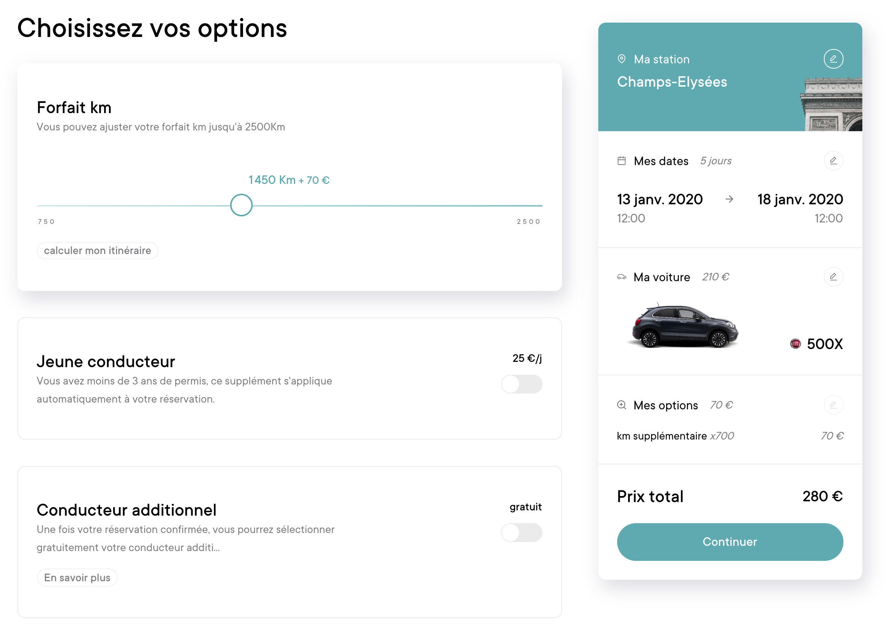

 <!-- .element height="75%" width="75%" -->

---

⛷🎿 in 4 weeks with kids

---

🚙 Rental car
Sunday → Sunday

---

It's closed

---

1 day before

+

1 day after

---

I need to pay 25% more

💳

---

---

[virtuo.com](https://www.govirtuo.com)

---

wants to digitize the Rental Car sector

---

🚙 📱

---

* 54 billion euros Worldwide
* 1 billion euros in France
* Historically complex

---

Wasted queuing for the rental desk 🖥

---

Paperwork for inspection 📝

---

😓

relou

(_time consuming_)

---

How?

---

by booking a premium-car with your phone 24/7

---

30 000 000 💶

---

to find, to book and to unlock a car with your 📱

---

 <!-- .element height="85%" width="85%" -->

---

 <!-- .element height="85%" width="85%" -->

---

 <!-- .element height="85%" width="85%" -->

---

🎯 Focus on the price feature

---

The rental price of the `Driver`

---

The profit of the `Partner`

---

The profit of `Virtuo`

---

5 steps

---

🚙 Euro-Kilometers

### Step 1

---

Rental price

### rental price = time + distance

---

🛣 Drive more, pay less

### Step 2

---

Decreasing pricing

* 10% after 1 day
* 30% after 4 days
* 50% after 10 days

---

💰 Give me all your money

### Step 3

---

Commission

* 30% of the booking price

---

* insurance → half of commission

---

* the Treasury → 1€ by person

---

* Virtuo → the rest

---

💸 The famous deductible

### Step 4

---

The deductible

4€/day

---

💳 Pay the actors

### Step 5

---

the driver, the partner

---

the insurance, the Treasury and Virtuo

---

👩‍💻 Just tell me what to do

---

## [92bondstreet/virtuo](https://github.com/92bondstreet/virtuo)

---

* Fork the project via `github`

---

* Clone the project

---

* Open index.html in your browser

---

* Check the ouput in your browser console

---

*  Solve each steps inside `index.js` file with JavaScript

---

* Once the step is solved, commit

---

* 5 steps... 5 commits

---

* Don't forget to push before the end of the workshop

---

READ

---

Really Really

READ
